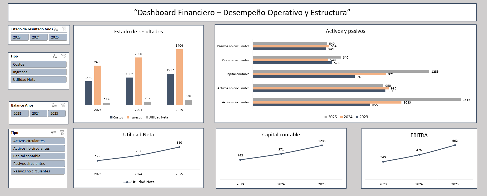
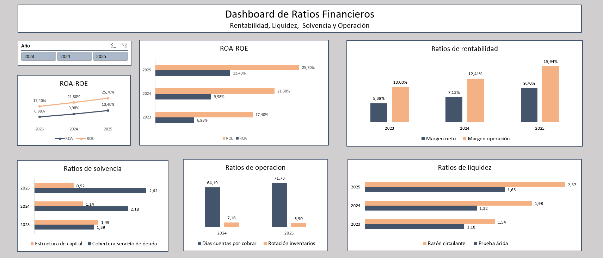
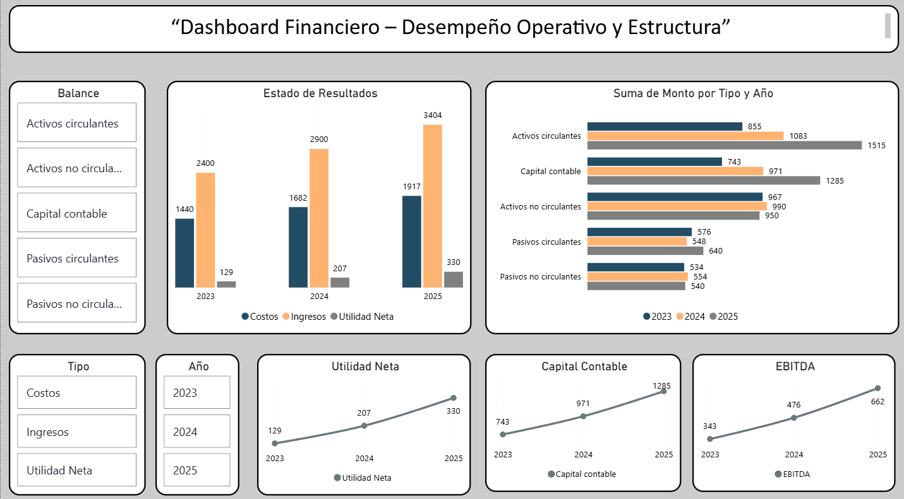
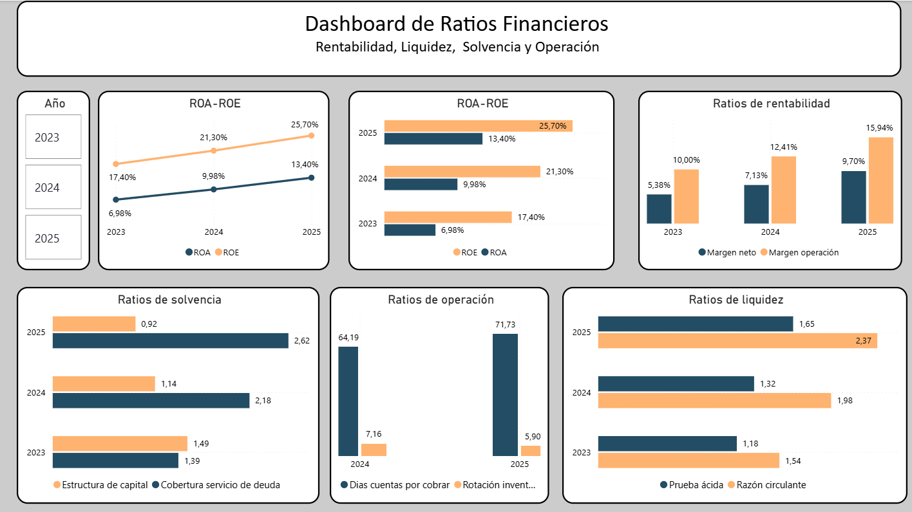

# Análisis Financiero - Andes Finance Group S.A. 2023–2025

##  Flujo de trabajo
- Análisis → Visualización → Informe

##  Objetivo
Elaborar los cuatro estados financieros principales (Estado de Resultados, Balance General, Estado de Cambios en el Patrimonio Neto y Estado de Flujo de Efectivo) de Andes Finance Group S.A. para los ejercicios 2023, 2024 y 2025, realizar análisis vertical y horizontal, calcular los ratios financieros más relevantes y construir dashboards interactivos con los resultados clave.

##  Fuentes de datos
- Notas y estados financieros de la empresa Andes Finance Group S.A.
- Período analizado: ejercicios cerrados al 31/12 de 2023, 2024 y 2025

##  Herramientas utilizadas
- Excel: armado de estados financieros, análisis vertical y horizontal, cálculo de ratios, tablas dinámicas y dashboard
- Power BI: dashboard dinámico interactivo con los principales KPIs financieros y ratios

##  Gráficos destacados

##  Informe completo
Podés ver el informe completo del proyecto en formato PDF:  
[Informe Análisis Financiero - Andes Finance Group](./reports/Informe_analisis_financiero.pdf)

**Autor:**  
**Matías Costa**  
Data Analyst | Estudiante de Licenciatura en Informática 